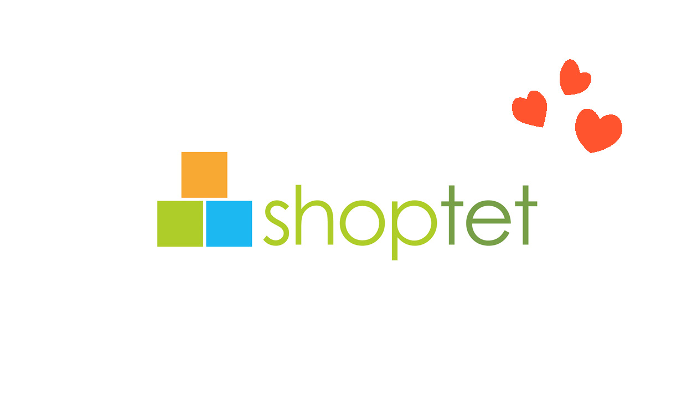
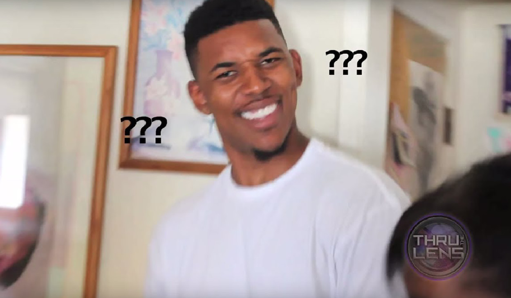
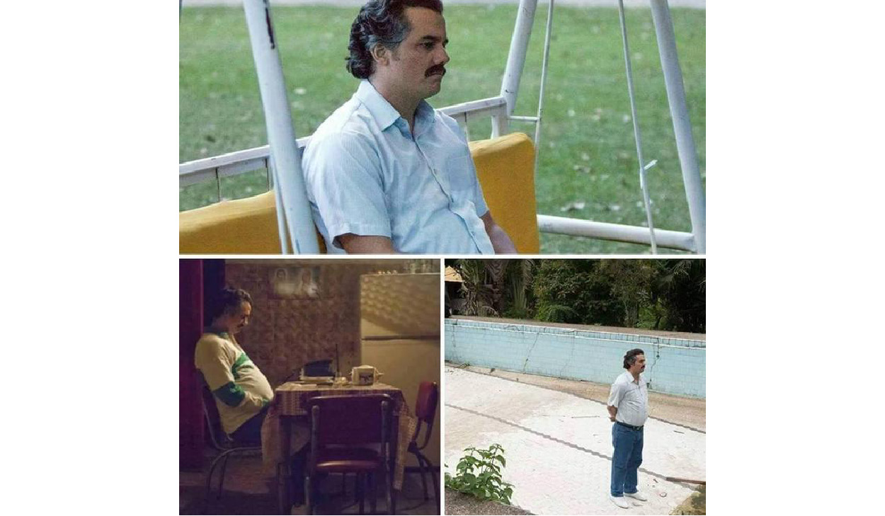
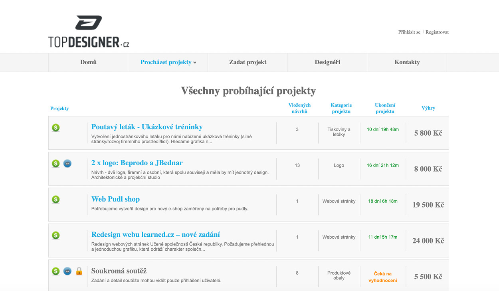
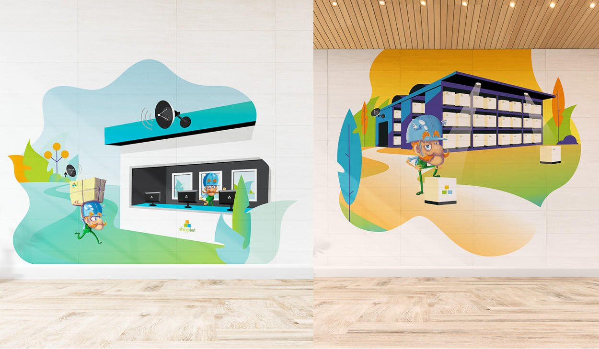
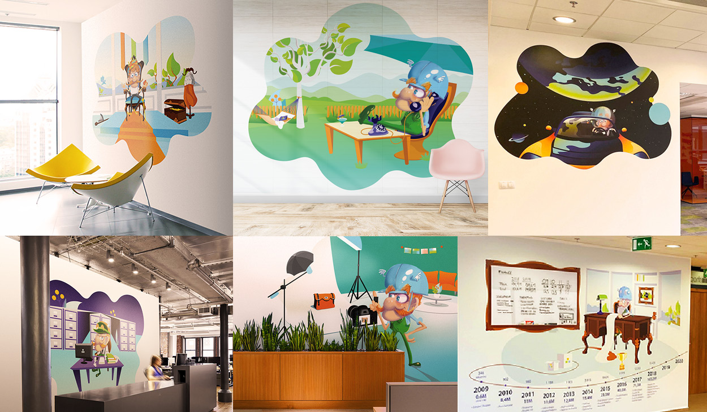
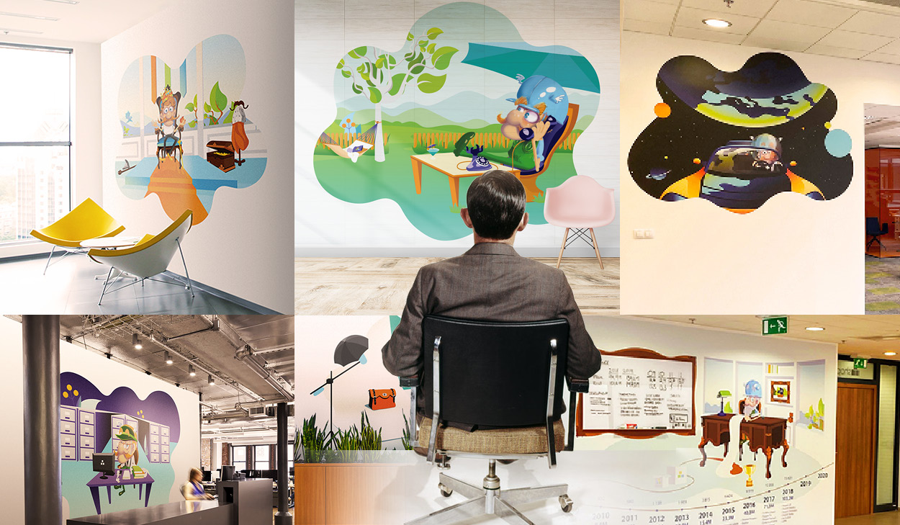
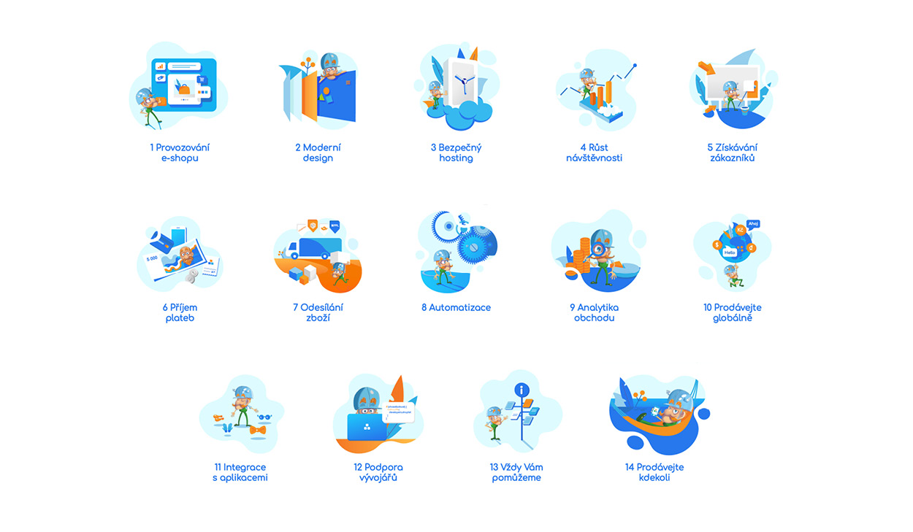

# Impression

## Title

When I think about my best portfolio pieces my mind goes immediately to my freelance work for Shoptet. Shoptet is the biggest E-commerce platform in Czech Republic with over 28 000 e-shops running on their servers and 21 billion dollars annual turnover. They could hire literally any designer they want to, so you probably asking…

…why on earth would they hire me?
Well let me tell you a story about how I got to do my 3 favourite portfolio pieces. 
It all started in summer 2019 right before I started as a freshman on this very school.

I had a lot of time on my hands and not much to do so I was trying my luck on the topdesigner.cz website.

Topdesigner is a site with open tenders which anyone with computer can compete in. And it was here where I found a Shoptet tender for office murals with their mascot Shoptetrix. After a week of working I send in my proposals.

Which you can see here. After another week I got a call from the CEO telling me that I won the competition and asking for another 6 murals.

After I infiltrated Shoptet offices with my illustrations it was very hard for the CEO to not think about me. So short time after he asked me to create a series of web illustration and uplift of their main page.

I have got a list of 14 main services that Shoptet offers to their users and created an illustration for each.

