# My best portfolio pieces

## Shoptet

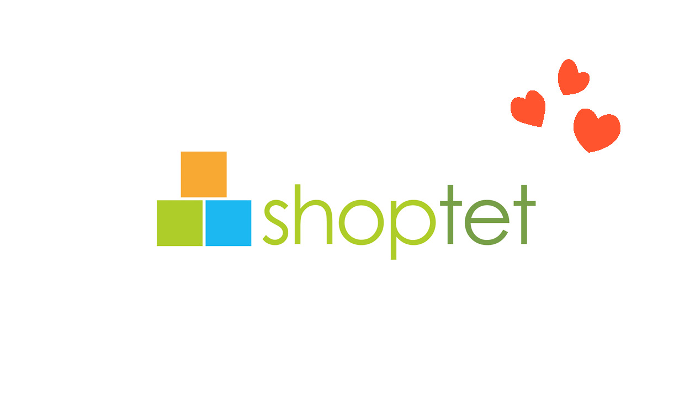

When I think about my best portfolio pieces my mind goes immediately to my freelance work for Shoptet. Shoptet is the biggest E-commerce platform in Czech Republic with over 28 000 e-shops running on their servers and 21 billion dollars annual turnover. You might be asking…

## What?

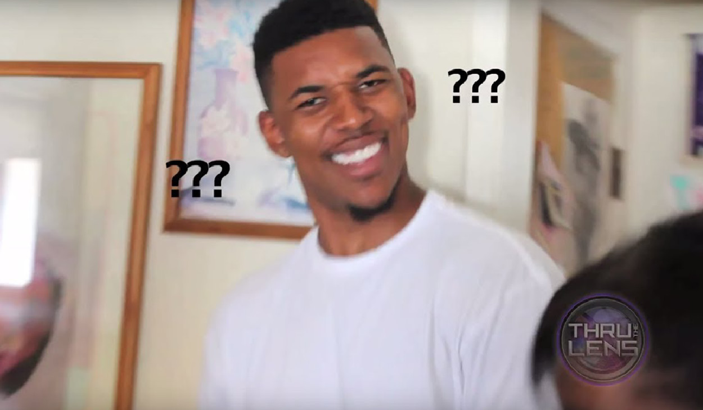

…why on earth did they hire me?
Well let me tell you a story about how I have got to do my 3 favourite portfolio pieces. 
It all started in summer 2019 right before I started as a freshman on this very school.

## Summer 2019

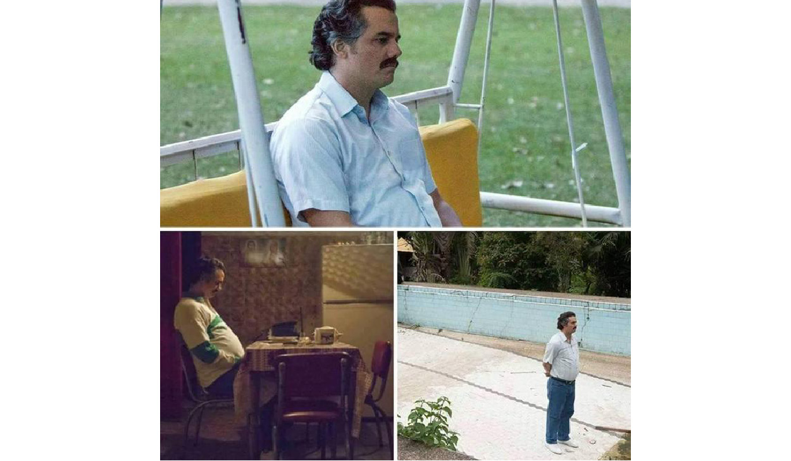

I had a lot of time on my hands and not much to do so I was trying my luck on the topdesigner.cz website.

## Topdesigner

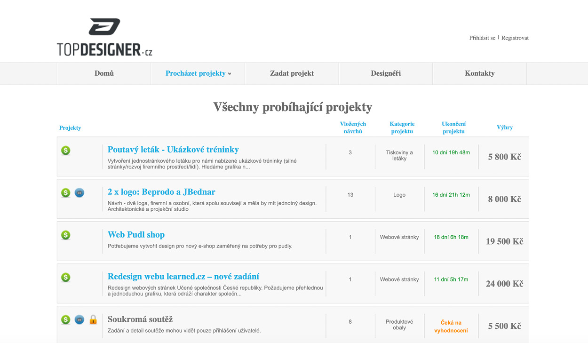

Topdesigner is a site with open tenders where anyone can join in with their design proposal. And it was here where I found a Shoptet tender for office murals with their mascot Shoptetrix. After a week of working I send in my proposals.

## Proposal

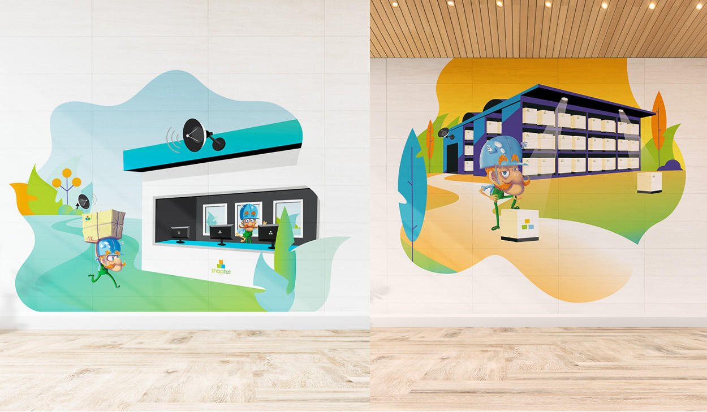

Which you can see here. 

## Murals

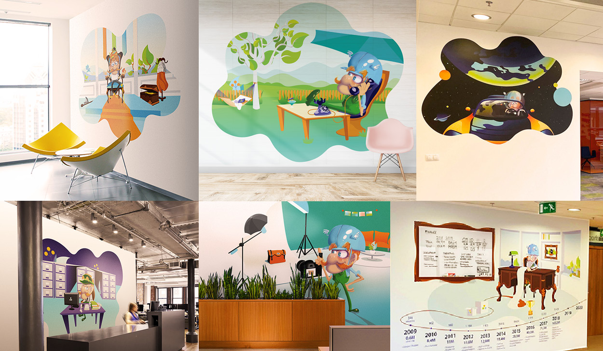

After another week I have got a call from the CEO telling me that I won the competition and asking for another 6 murals.

## CEO

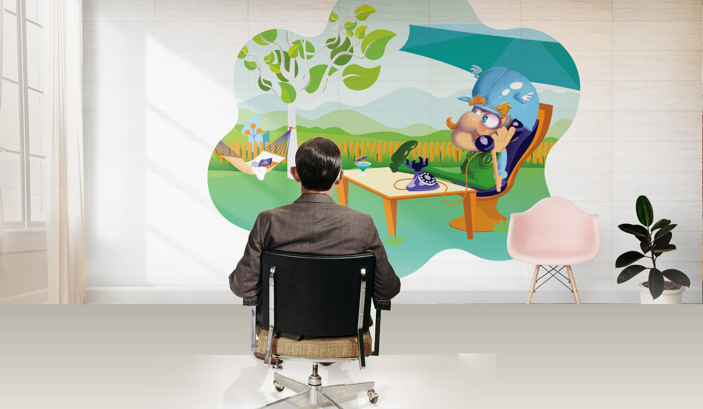

After I infiltrated Shoptet offices with my illustrations it was very hard for the CEO to stop thinking about me. So short time after he asked me to create a series of web illustration and uplift of Shoptet's main page.

## Web illustrations

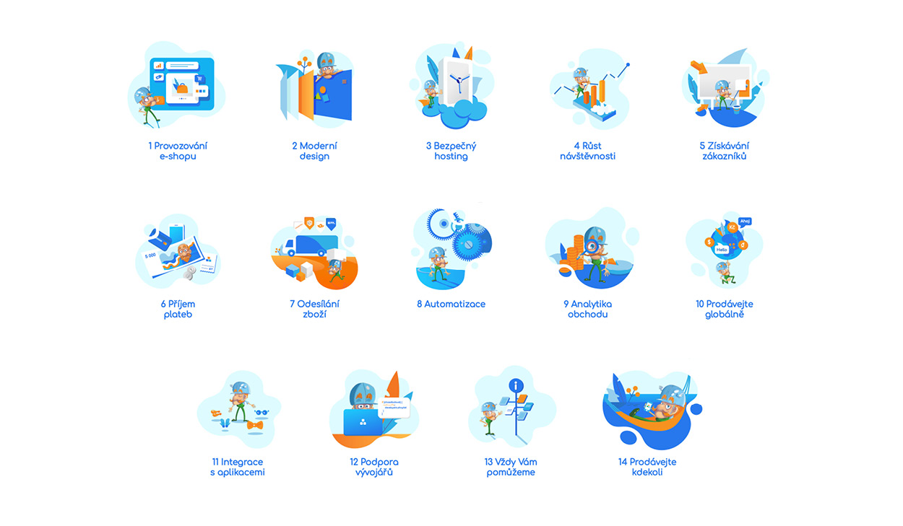

I have got a list of 14 main services that Shoptet offers to their users and created an illustration for each.

## Main page

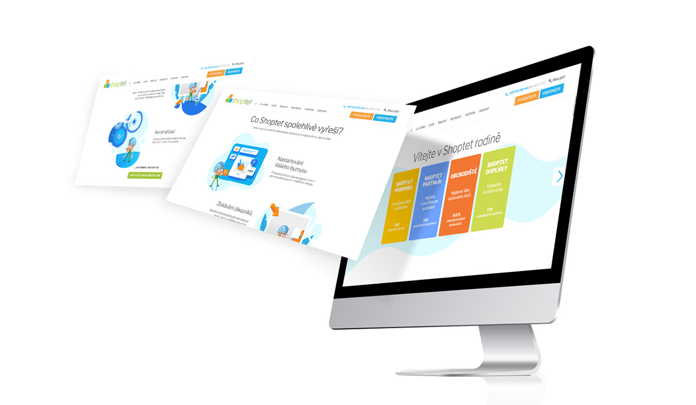

I used those illustrations in the main page uplift. 
After few smaller jobs on different subpages I have got my third best portfolio piece job.

## Shoptet premium

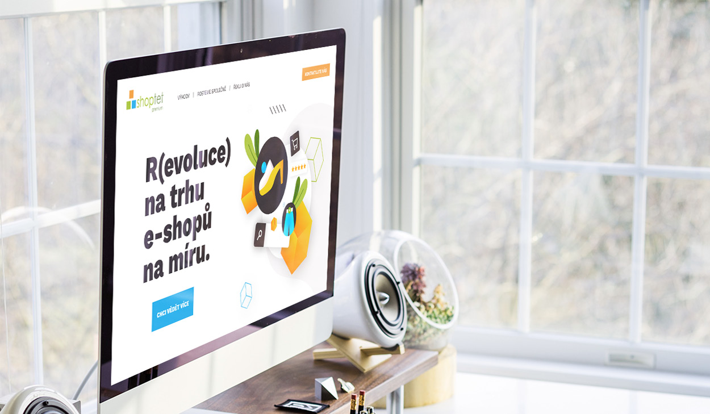

The landing page design for Shoptet's new platform called Shoptet premium which launched this year.

## Illustrations

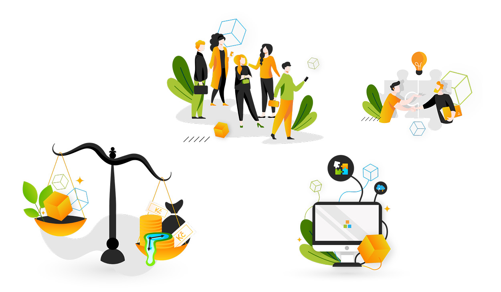

And a mini series of illustrations for Shoptet premium related presentations to clients.

---

## The End

