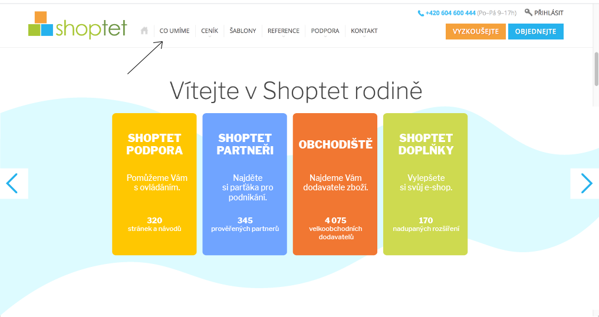
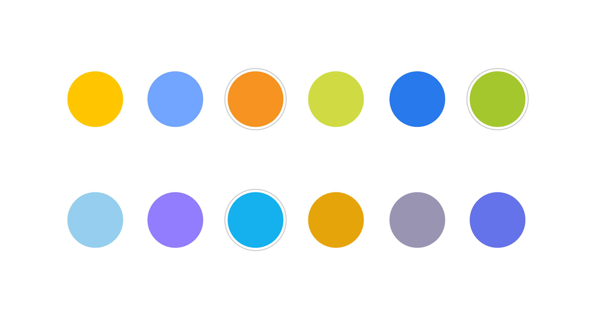

# Case study

## Shoptet's "What we do" page

Being an e-commerce platform Shoptet's bussines is based predominantly on the internet. More specifically on their page shoptet.cz. It is the face that they're showing the world and therefore one of the most important parts of their business. Shopted aimed to make the main page and the first subpage "What we do" more visually attractive for users and the marketing team decided that illustrations with their mascot are the key. There are 14 main services that Shopted offers and each of them needed an illustration. That is when they contacted me.

## Brief

I got a list of all of the services with a short description. In the beginning, they asked me for the first three illustrations to see if they like the results. The only condition was that each illustration has to include Shoptet's mascot Shoptetrix. I needed to come up with a concept for each illustration that would fit the category and its description the best. Also, I needed to bear in mind the overall visual style of the website, especially the colors.  

## Color pallet

I started by creating a color pallet that would fit the website design. There are three colors in the Shoptet's logo - orange, blue and green. The green is already represented by the Shoptetrix's outfit by default. Therefore I left green out of the color palette and reserved it for Shoptetrix only, ensuring that he would always stand out in the image. Instead, I focused on the orange and the blue. I matched the two with other tones of orange and blue ending up with two harmonious palettes complementing each other and preparing a great base for mostly green Shoptetrix.

## First 3 concepts

