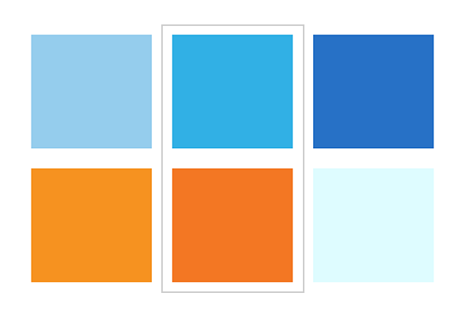

# Case study

## Shoptet's "What we do" page

Being an e-commerce platform Shoptet's bussines is based predominantly on the internet. More specifically on their page shoptet.cz. It is the face that they're showing the world and therefore one of the most important parts of their business. Shopted aimed to make the main page and the first subpage "What we do" more visually attractive for users and the marketing team decided that illustrations with their mascot are the key. There are 14 main services that Shopted offers and each of them needed an illustration. That is when they contacted me.

## Brief

In the beginning, I was asked for the first three illustrations as a trial. I was given the names of the 3 categories with short description for each. 

 1. Safe hosting
 2. Site traffic boost
 3. Marketing

Shoptet's conditions: 
  - Each illustration has to include Shoptet's mascot Shoptetrix. 

My conditions: 
  - Giving each illustration a concept that will fit the category and its description the best. 
  - Bearing in mind the overall visual style of the website, with emphasis on the colors.  

## Color pallet

I started by creating a color pallet that would fit the website design. There are three colors in the Shoptet's logo - orange, blue and green. The green is already represented by the Shoptetrix's outfit by default. Therefore I left green out of the color palette and reserved it for Shoptetrix only, ensuring that he would always stand out in the image. Instead, I focused on the orange and the blue. I matched the two with other tones of orange and blue ending up with two harmonious palettes complementing each other and preparing a great base for mostly green Shoptetrix.

## First 3 illustrations

I got a list of all of the services with a short description.

