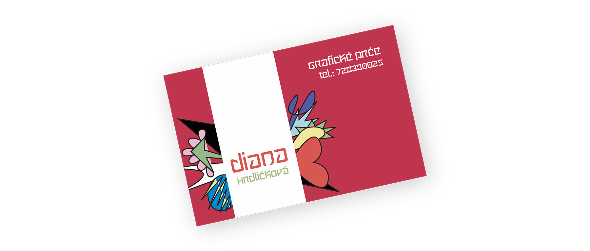
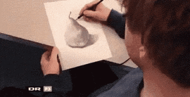
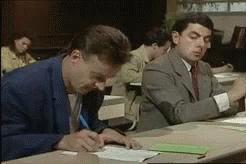

# The moment I realized that I want to be a great graphic designer 
by Diana Štěpničková

I tried to design. After learning how to awkwardly operate Illustrator I tried to design my very own business card. "Diana Hrdličková" — I'm writing down in illustrator typing into a text box next to my very first vector illustration that I'm overly proud of. After admiring it some more, I add — "Graphic designer" into the upper right corner. My head is already spinning — not a career with routine tasks repeating in a tiring, never-ending circle. But a craft that I can hone. A skill to nurture and wield throughout a lifetime. I clicked with a design like Romeo did with Juliet. Every minute spend on design is a minute well-spent thanks to the promise I didn't even realize I made to myself. I will become a great designer. No matter how long it will take. No one can stop me.

..

That was the moment I realized that I wanted to be a great graphic designer. But one does not simply become a great designer. When I tried to design a random project, the results were catastrophic. The more I learned about design the more lost I felt. 

After a series of jobs for business owners that didn't want to spend their budget on actual designers and one year of busy work in a local graphic studio I still wasn't a proper designer. Let alone a great one. I didn't like the jobs I was working on. Why don't I ever work on projects as I see on [Dribbble](https://dribbble.com) ? Those designs. Looking like there couldn't possibly be a better way to design them. Feeling just right. Everything fits together in a perfect visual orchestra. If only I was given the same brief as them I was sure I could do it. 

I needed to get on track. I needed to learn from actual designers. Have them show me their ways. I gathered my best pieces and applied to design school. 

In my first year, it was made clear to me that my goal isn't to create a beautiful design at all. The visual side of the design is but a manifestation of the message that stands behind it. A pretty image is rendered useless unless it carries a deeper meaning. That came as a shock. Not only do I need to learn how to create stunning work. Now I need to go looking for some deeper meaning as well. Every single time. But what seemed to be such a bother at the beginning has become a key to designing later. This was why my designs didn't work. And it was also why those designs I admired felt so right. They weren't just a facade, they were the whole building. I realized that I wasn't waiting for the right brief. I was waiting for myself to change my attitude towards them. In the following years, I have learned the complete design process and whenever I'm on a project I can't help but act like it is the "Next in design" final (even if I'm working on my grandma's business card). I am in the final semester of college and I am pretty sure that I am becoming a proper designer. And one day I will become a great one. No matter how long it will take. No one can stop me.

## About Me

I am Diana, illustrator, graphic designer and mediocre ukulele player based in Kutná Hora. With my front-end developer husband and our 1 year old son we live in the beautiful historical city of Kutná Hora right next to a river and a deciduous forest. At this moment it is my third year studying graphic design program in the college of creative communication. I have working experience in illustration, web design, print design and visual identity.

## Research

[Design story moodboard](https://www.figma.com/file/BaIiKJCK2WRU3MPyZmiZ0Z/Storytelling?node-id=0%3A1.org)

