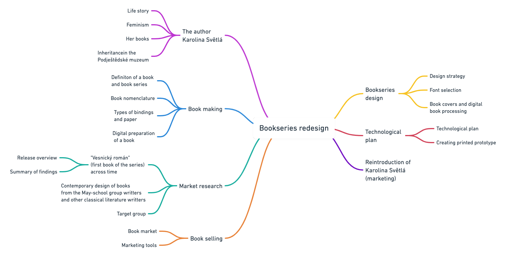

<!-- Table of Contents, in-page navigation -->

- [Summary](#summary)
- [Mind Map](#mind-map)
- [Keywords](#keywords)
- [Key Points](#key-points)
- [Warm-up](#warm-up)
- [References](#references)

# Rediscovering Karolina Světlá

## Summary

By redesigning a bookseries Ještědské romány I would like to reintroduce a significant Czech writter from the group May School, and one of the first Czech feminists – Karolina Světlá, to the young generation. 

## Mind map

  
<b>open</b>

  

## Keywords

- **Karolina Světlá**

- **May-school**

- **Feminism**

- **Book series**

- **Graphic design**

## Key Points

1. Background: Redesign of the classical literature book series "Ještědské romány" from the author Karolina Světlá.
2. Purpose: Reintroducing a significant czech writter from the group May-school, and one of the first czech feminists – Karolina Světlá, to the young generation. 
3. Research: I researched previous editions of the book "Vesnický román" and looked into the current design of classic literature.
4. Findings: The number of published edition has been slowly decreasing over the years.
5. Conclusion: If published, the book series could help keep alive the memory of the writter Karolina Světlá and make classic literature more attractive for younger generation.

## Warm-up

1. Problem  
- Reintroduced KS to younger generation
- Making her book series more atractive for current readers.
 
2. Action
- Finding all the editions of the first book from the book series and studiyng the design development from 1867 to 2019
- Looking at current design of the books from classical writters (especially from the May-school writters group).
- Visiting the Podještědské museum to look at KS inheritence.

3. Result
- If published, the book series could help keep alive the memory of the writter Karolina Světlá and make classic literature more attractive for younger generation.

## References

- [Podještědské museum](https://www.muzeumceskydub.cz/en)
- [In the Footsteps of Karolina Světlá](http://www.karolinasvetla.cz/en/)
- [Karolina Světlá - wikipedia](https://en.wikipedia.org/wiki/Karolina_Sv%C4%9Btl%C3%A1)
