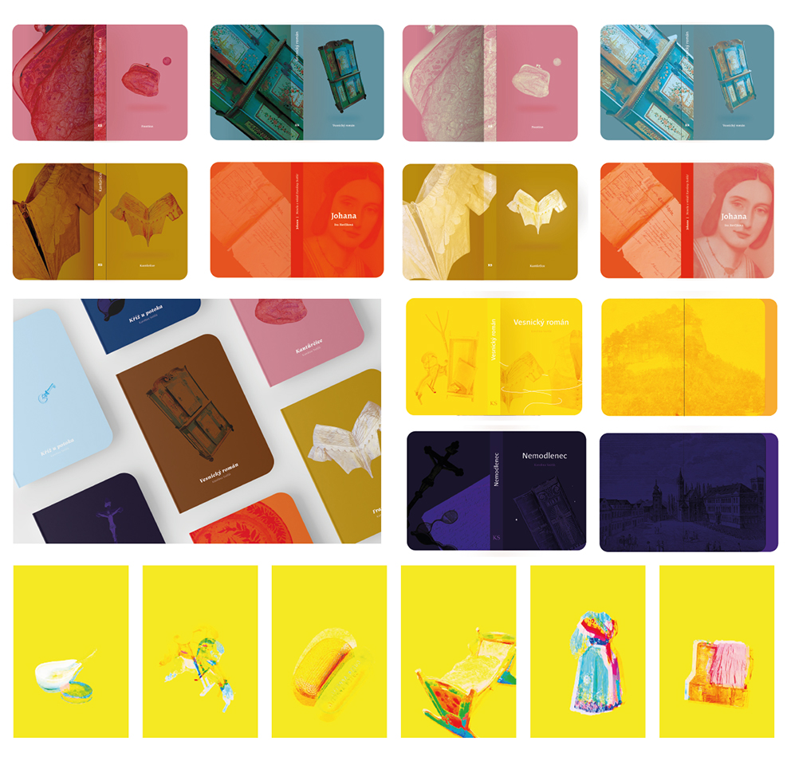
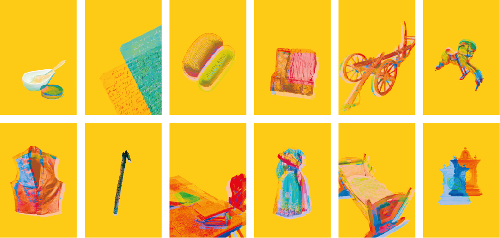
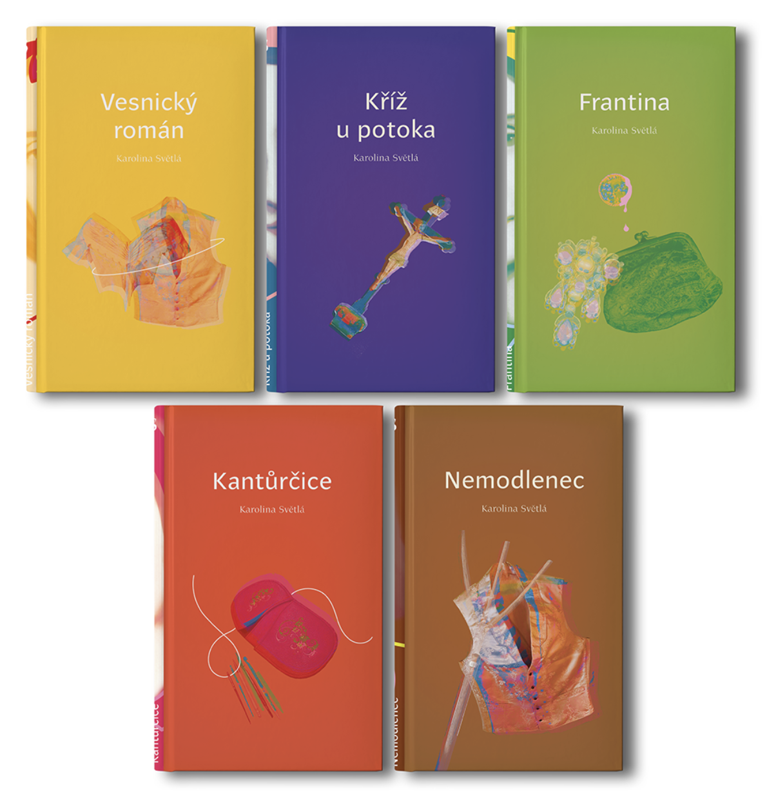
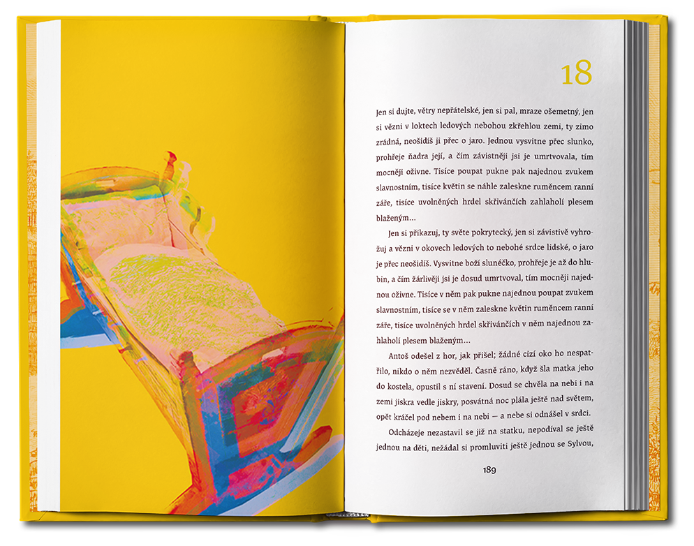
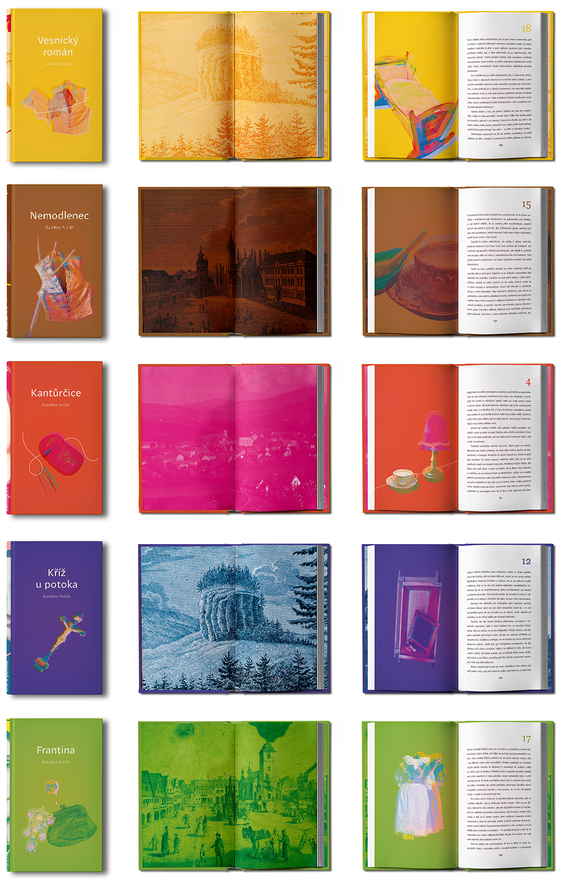
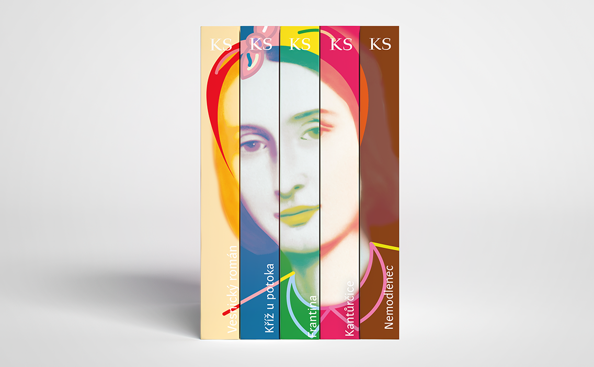
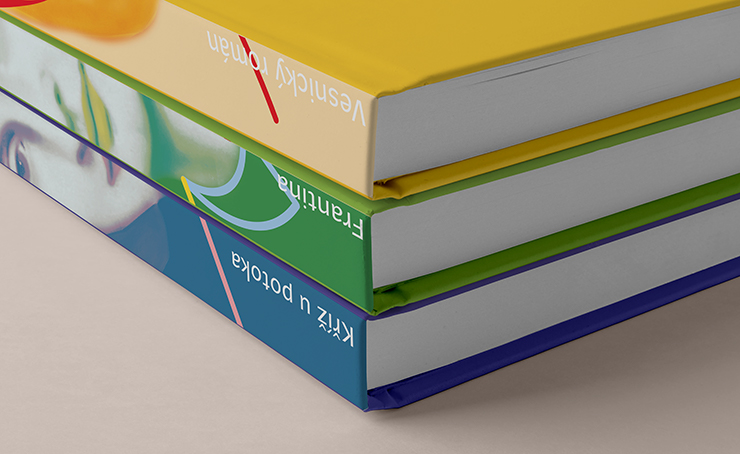

# Digest: Rediscovering Karolina Světlá

# Rediscovering Karolina Světlá

Author Name: Diana Štěpničková

E-mail: dianastepnickova@gmail.com

Acknowledgements:  I would like to thank Mr. MgA. Miroslav Roubíček for the advice and guidance in the development of this thesis and also throughout my studies. Furthermore to Mr. Mgr. Jaroslav Tvrdoň for the typographic knowledge and the expert information he provided me with during the preparation of "The Village Novel", and to my family for their support.

Data Accessibility/Availability Statement: There is no data archived.

<!-- See https://www.cambridge.org/core/services/authors/open-data/data-availability-statements -->

Word count: 497

# Digest: Rediscovering Karolina Světlá

## Abstract

By redesigning a bookseries Ještědské romány I would like to reintroduce a significant czech writter from the group May School, and one of the first czech feminists – Karolina Světlá.

## Keywords

book series, feminism, graphic design, Karolina Svetla, may school

## Main Text

This paper is focused on creating a unified visual identity for the book series Ještědské romány and connecting it with a suitable marketing solution. The result should help reintroduce the author to the age group of 18-30yo and support the sale of her books. 

Karolina Světlá is a Czech writer from the May School group and one of the first Czech feminists. The first part of the paper is focusing on collecting materials about the writer's life, work, merits in the field of feminism, and inheritance in the Podještědské Museum. It examines the development of the book "The Village Novel" (one of the books from the Ještědské romány series) from 1867 to 2019. Apart from the chronological list of all editions, the research shows the different approaches to design and typography due to the changing technological conditions in book printing. It also distinguishes the different stages of the perception of the author itself. From underground writer being printed in national revival publications to the national hero with gold woven books to the almost forgotten writer cramped up in a big series of classical literature. 

The paper also introduces the issues of book printing, contains a quick insight into the book market, and considers the importance of e-books. The graphic solution in the practical part strives to connect the old elements with the new one so that the books remain true to their content, but are at the same time addressing the target group.

## References

- [Podještědské museum](https://www.muzeumceskydub.cz/en)
- [In the Footsteps of Karolina Světlá](http://www.karolinasvetla.cz/en/)
- [Karolina Světlá - wikipedia](https://en.wikipedia.org/wiki/Karolina_Sv%C4%9Btl%C3%A1)

## Images

First, I needed to edit the photographs of the inheritance and other historical objects, which will become a key visual element of the book edition. I started by testing different digital effects on photos, which I also tried to combine with a suitable color palette. During testing, I observed how the mood of the photos changed with different colors and effects. With low intensity effects in combination with less saturated colors, the illustrations looked museumy and didn't look modern enough to balance the historical content. On the contrary, with a high intensity effects and too bright colors, there was a readability problem.

### Illustration series for "The Village Novel"

I tried to find the ideal balance in which the illustrations would look modern and retain their readability. I chose a cheerful color palette with lighter, rich colors and created a series of illustrations for the book called "The Village Novel".

### Cover design
I applied the illustrations to the book covers and chosen chapters in the book so that they always accompany the story.

### Inside "The Village Novel"

### Unified visual identity

### Book spines forming an image of Karolina Svetla

