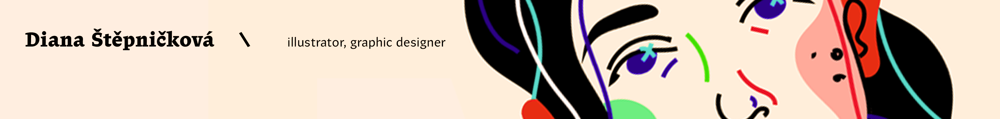
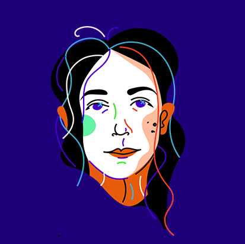

I am an illustrator, graphic designer, and mediocre ukulele player based in Kutná Hora. With my front-end developer husband and our 1 year old son, we live in the beautiful historical city of Kutná Hora right next to a river and a deciduous forest. Here I am working on illustrations, and web and print designs.

- [My story](03-aboutness/index.md)
- [View CV](04-experience/pdf/cv-stepnickova.pdf)

- Case Study: [Shoptet's illustration system](03-aboutness/case-study.md)
- Impression: [My best portfolio pieces](02-impression/index.md)
- Character & Description [Letter D](01-character-description/index.md)
- Storytelling: [My design story](https://github.com/Dijajana/english-for-designers/blob/main/06-storytelling/index.md)

Thesis
- Thesis digest: [Karolina Světlá](10-thesis-digest/index.md)
- Presentation:[Thesis presentation](11-presentation/index.md)

- Extra: 
[Takeaways](extra-takeaways/index.md)
and
[Year review](year-review/index.md)

 
- [View coursework](https://github.com/dijajana/english-for-designers) 

- email: stepnickovadiana@gmail.com

